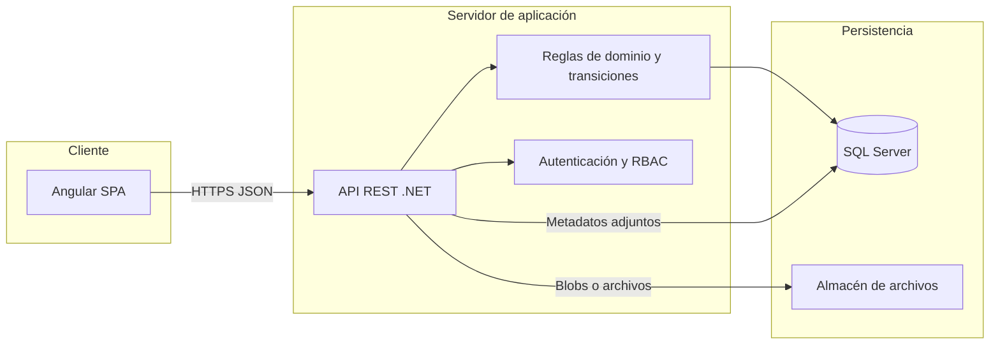

# Documento de Especificación Técnica e Institucional

## Sistema de Solicitudes Tecnológicas Gubernamentales

**Producto mínimo viable (MVP)** — Línea base única para implementación

---

## 1. Portada

| Campo | Contenido |
| ----- | --------- |
| **Título** | Sistema de Solicitudes Tecnológicas Gubernamentales — Especificación técnica e institucional del MVP |
| **Tipo de documento** | Documento de arquitectura y requisitos para implementación |
| **Versión del documento** | 1.0 |
| **Fecha** | 14 de abril de 2026 |
| **Órgano u organismo responsable** | *[Completar denominación oficial de la institución]* |
| **Área técnica / de sistemas** | *[Completar unidad responsable del producto]* |
| **Clasificación de la información** | Uso interno institucional (según política local) |
| **Estado** | Aprobado para guía de implementación del MVP |

**Referencias de documentación técnica integrada:** alcance congelado (01), matriz RBAC (02), estados y contrato API (03), plantillas por tipo (04), esquema de auditoría (05), backlog UI y criterios (06).

---

### Nota de contexto del repositorio

Para esta instancia del repositorio, el MVP fue implementado como **proyecto personal** por **Jorge Alberto Gutierrez Chaidez**, con apoyo de asistencia de IA.

En consecuencia:

- las referencias institucionales del documento se conservan como **marco de dominio** y especificación objetivo;
- la trazabilidad de cierre y aceptación real de esta ejecución se documenta en:
  - `docs/08-guia-uso-y-verificacion-mvp.md`
  - `docs/09-acta-cierre-y-aceptacion-mvp.md`
- los pendientes controlados de cierre (PC-01 y PC-02) se gestionan como backlog post-MVP.

---

## 2. Control de versiones

| Versión | Fecha | Autor / responsable | Descripción resumida |
| ------- | ----- | -------------------- | -------------------- |
| 1.0 | 14/04/2026 | Equipo del proyecto | Versión inicial unificada: integra documentos 01–06 en un solo instrumento formal. |
| 1.1 | 17/04/2026 | Jorge Alberto Gutierrez Chaidez | Se agrega nota de contexto para ejecución personal del MVP y referencias de trazabilidad de cierre. |

**Alineación con el alcance congelado:** cualquier modificación sustantiva del alcance del MVP debe reflejarse en el documento de alcance congelado correspondiente, incrementar la versión y registrarse en la tabla de registro de cambios de ese documento. Este documento de especificación debe actualizarse de forma coherente cuando se aprueben dichos cambios.

---

## 3. Índice

1. [Portada](#1-portada)  
2. [Control de versiones](#2-control-de-versiones)  
3. [Índice](#3-índice)  
4. [Introducción](#4-introducción)  
5. [Justificación](#5-justificación)  
6. [Objetivo general](#6-objetivo-general)  
7. [Objetivos específicos](#7-objetivos-específicos)  
8. [Alcance del MVP](#8-alcance-del-mvp)  
9. [Arquitectura del sistema](#9-arquitectura-del-sistema)  
10. [Control de accesos (RBAC)](#10-control-de-accesos-rbac)  
11. [Estados del sistema y contrato API](#11-estados-del-sistema-y-contrato-api)  
12. [Plantillas y campos por tipo](#12-plantillas-y-campos-por-tipo)  
13. [Auditoría del sistema](#13-auditoría-del-sistema)  
14. [Interfaz de usuario y backlog](#14-interfaz-de-usuario-y-backlog)  
15. [Criterios de aceptación](#15-criterios-de-aceptación)  
16. [Consideraciones de seguridad](#16-consideraciones-de-seguridad)  
17. [Limitaciones del MVP](#17-limitaciones-del-mvp)  
18. [Trabajo futuro](#18-trabajo-futuro)  
19. [Conclusiones](#19-conclusiones)  

---

## 4. Introducción

El presente documento consolida la especificación del **Sistema de Solicitudes Tecnológicas Gubernamentales** en su versión **MVP**, orientada a una **implementación real** sobre la pila tecnológica institucional acordada: aplicación cliente **Angular**, servicios de aplicación **.NET** y persistencia **Microsoft SQL Server**, con almacenamiento de archivos adjuntos en repositorio compatible con la plataforma de despliegue.

El sistema tiene por finalidad digitalizar y estandarizar el **ciclo de vida** de las solicitudes de naturaleza tecnológica (adquisición, licenciamiento, desarrollo, infraestructura, soporte, seguridad de la información e interoperabilidad de datos), en un entorno de **usuarios internos** (funcionarios y personal autorizado con cuenta institucional). No sustituye por sí solo las normas internas de adquisiciones o seguridad de la información de la organización; **instrumenta** el flujo, la trazabilidad y el control de acceso conforme a roles.

**Propósito de este documento:** servir como **única línea base** alineada entre negocio, diseño de base de datos, API REST, interfaz de usuario y pruebas, reduciendo ambigüedad y desalineación entre capas. Las decisiones aquí contenidas tienen carácter de **especificación técnica** para el MVP; las ampliaciones posteriores se tratarán como nuevas versiones de producto o nuevos módulos.

**Audiencia:** responsables de proyecto, arquitectura de software, desarrollo (front-end y back-end), administración de bases de datos, seguridad de la información y áreas usuarias de las solicitudes tecnológicas.

---

## 5. Justificación

Las instituciones públicas y organismos con mandato gubernamental requieren **trazabilidad demostrable** de las decisiones sobre inversiones y actuaciones tecnológicas, así como **segregación de funciones** entre quien solicita, quien analiza, quien aprueba y quien ejecuta. Los procesos apoyados únicamente en correo electrónico o documentos dispersos generan riesgos operativos, dificultan auditorías y reproducen inconsistencias en la información.

Un MVP centrado en **personal interno** permite:

- Reducir la complejidad de integración con identidades externas y canales de atención ciudadana en una primera fase.  
- Priorizar la **calidad del flujo**, la **auditoría** y el **control de accesos basado en roles (RBAC)** como cimiento institucional.  
- Entregar valor operativo temprano: una solicitud puede completar **todo el ciclo** (desde borrador hasta cierre o cancelación) con registros auditables.

La exclusión deliberada de ciertos alcances en el MVP (por ejemplo, portal ciudadano o firma electrónica avanzada) no implica desconocer su importancia; se trata de una **secuencia de entrega** que mitiga riesgos y costos de implementación, manteniendo la posibilidad de evolución mediante APIs y módulos acoplados.

---

## 6. Objetivo general

Establecer e implementar un **producto mínimo viable operable** que permita gestionar solicitudes tecnológicas institucionales de punta a punta, con **autenticación de usuarios internos**, **autorización por roles**, **flujo de estados y transiciones explícitas**, **adjuntos y comentarios** (públicos e internos), **auditoría persistente** y **exportación de información** para análisis, de acuerdo con la especificación contenida en este documento.

---

## 7. Objetivos específicos

1. **Ciclo de vida completo:** habilitar el recorrido crear → análisis TIC → aprobación → ejecución → validación del solicitante → cierre, con estados terminales definidos (rechazo, cancelación, cierre satisfactorio).  
2. **Contrato de dominio estable:** mantener identificadores de estados, tipos, prioridades, roles y transiciones **coherentes** entre base de datos, API, cliente y documentación OpenAPI.  
3. **RBAC:** restringir pantallas, operaciones de API y visibilidad de datos sensibles (por ejemplo, comentarios internos) según la matriz de permisos aprobada.  
4. **Plantillas por tipo de solicitud:** validar campos comunes y `specificPayload` por tipo antes del envío formal (`Submit`).  
5. **Adjuntos:** aplicar límites de tamaño y cantidad, lista blanca de extensiones y metadatos en base de datos.  
6. **Auditoría:** registrar eventos de creación, cambios relevantes, transiciones, adjuntos, comentarios y administración, con posibilidad de correlación (`correlationId`).  
7. **Notificaciones in-app:** bandeja de pendientes y actividad reciente; correo electrónico opcional si existe SMTP institucional.  
8. **Reportes:** exportación CSV/Excel desde listados filtrados, respetando el alcance de datos del rol.  
9. **Interfaz de usuario:** cubrir el backlog priorizado (P0 imprescindible, P1 MVP completo) con criterios de aceptación verificables.

---

## 8. Alcance del MVP

### 8.1 Principio de alcance

El MVP no se define únicamente como “lo mínimo programable”, sino como el **conjunto mínimo que permite operar el proceso real** con trazabilidad, roles y control. Las decisiones aquí expuestas se consideran **congeladas para la implementación del MVP**; los ajustes posteriores constituyen **cambio de alcance versionado** y deben ser validados con los interesados institucionales.

### 8.2 Usuarios y ámbito

| Decisión | Valor en el MVP |
| -------- | --------------- |
| Usuarios principales | Personal de la institución (funcionarios o contratistas con cuenta institucional autorizada). |
| Portal ciudadano / usuarios externos | **Fuera de alcance.** Una eventual fase posterior podrá definirse como módulo o sistema acoplado por API. |
| Justificación | Reduce riesgos en autenticación, soporte y marco legal en la primera entrega; prioriza trazabilidad y aprobaciones internas. |

**Validación con partes interesadas:** confirmar que ningún trámite de ciudadanos externos sea obligatorio dentro del plazo del MVP.

### 8.3 Notificaciones

| Decisión | Valor en el MVP |
| -------- | --------------- |
| Obligatorio | Bandeja **in-app**: “Mis pendientes”, “Actividad reciente”, contadores por rol cuando aplique. |
| Correo electrónico | **Opcional:** si existe servicio SMTP institucional, notificaciones en eventos clave (envío, devolución, aprobación, asignación, cierre). Si no hay SMTP, solo notificación in-app. |
| SMS / notificaciones push móvil | Fuera de alcance. |

### 8.4 Adjuntos

| Decisión | Valor en el MVP |
| -------- | --------------- |
| Almacenamiento | Archivos en almacén compatible con .NET (ruta local en desarrollo; almacén de objetos o recurso compartido en producción); **metadatos en SQL Server**. |
| Límites | Tamaño máximo por archivo: **10 MB** (parametrizable). Máximo **10 archivos** por solicitud en el MVP. |
| Tipos permitidos | Lista blanca: `pdf`, `png`, `jpg`, `jpeg`, `docx`, `xlsx`, `csv`, `zip` (sin ejecutables). |
| Antivirus | **Deseable** en fase posterior o si existe servicio institucional; en el MVP: validación de extensión, tipo MIME y tamaño. |
| Versionado | Un adjunto equivale a una versión; un reemplazo genera **nuevo registro** vinculado o nuevo adjunto (no sobrescribir sin historial). |

### 8.5 Comentarios y visibilidad

| Decisión | Valor en el MVP |
| -------- | --------------- |
| Comentarios | Por solicitud, con autor, fecha y texto. |
| Notas internas | Comentarios marcados como **internos**, visibles solo para roles TIC, Aprobador, Administrador y Auditor (no visibles para el Solicitante). |
| Comentarios al solicitante | Visibles para el solicitante (sin marca de interno). |

### 8.6 Identidad y seguridad (alcance)

| Decisión | Valor en el MVP |
| -------- | --------------- |
| Autenticación | Integración con proveedor institucional si existe (**Azure AD**, **Active Directory** u **OpenID Connect**). Si no aplica, **cuenta local** con política mínima de contraseña definida en despliegue. |
| Autorización | RBAC en aplicación; permisos alineados con la matriz RBAC (sección 10). |
| Firma electrónica avanzada | Fuera de alcance; la decisión queda registrada en auditoría con usuario, rol, fecha e identificador de cliente cuando aplique. |

### 8.7 Incluye y excluye (resumen)

**Incluye (versión 1 del MVP)**

- Ciclo de vida completo: crear → análisis → aprobación → ejecución → validación → cierre.  
- Estados y transiciones según el contrato de API (sección 11).  
- Catálogos maestros mínimos (tipos, prioridad, unidad organizativa).  
- Adjuntos con las reglas de la sección 8.4.  
- Auditoría según el esquema de la sección 13.  
- Reportes exportables (CSV/Excel) desde listados filtrados.  

**Excluye (post-MVP o fases posteriores)**

- Integración en tiempo real con ERP o sistemas de presupuesto.  
- Motor BPM gráfico editable por usuario de negocio.  
- Portal ciudadano, firma avanzada, SLA con escalamiento multinivel complejo.  
- Reapertura de solicitudes cerradas (alternativa: nueva solicitud vinculada en fase 2).  

### 8.8 Criterios de aceptación del MVP a nivel de negocio

1. Una solicitud puede recorrer **todo el flujo** sin pasos manuales obligatorios fuera del sistema (salvo la carga o mantenimiento de datos maestros por perfil Administrador, según política).  
2. Cada cambio de estado deja **registro auditable** y **motivo** donde las reglas de negocio lo exigen.  
3. Los roles solo visualizan y ejecutan las acciones definidas en la matriz RBAC.  

---

## 9. Arquitectura del sistema

### 9.1 Visión general

La solución se organiza en capas lógicas que separan presentación, orquestación de casos de uso, reglas de dominio, persistencia y almacenamiento de archivos. El **servidor** es la autoridad en validación de transiciones, autorización y filtrado de datos sensibles.



### 9.2 Cliente (Angular)

- Aplicación de página única (**SPA**) que consume la API REST versión `/api/v1`.  
- Presentación de formularios dinámicos según `RequestType` y validaciones coherentes con el servidor.  
- Gestión de sesión y, cuando aplique, **rol activo** para filtrar menús y acciones.  
- Manejo de errores con **Problem Details** (`RFC 7807`) y presentación de `correlationId` en mensajes de error para soporte.  

### 9.3 Servidor (.NET)

- Exposición de **API REST** con contratos alineados a los enumerados del dominio (estados, transiciones, tipos).  
- Validación de comandos: una transición se invoca mediante un **comando explícito** (`transition`), no mediante escritura directa del estado destino.  
- Autorización basada en **políticas** y/o claims; coherencia con la matriz RBAC.  
- Registro estructurado de logs y **middleware de correlación** (`CorrelationId` generado o propagado desde cabeceras).  
- Transaccionalidad: persistencia de cambios de solicitud y registros de auditoría en la misma unidad de trabajo cuando el diseño lo permita.  

### 9.4 Base de datos (SQL Server)

- Datos transaccionales de solicitudes, catálogos, usuarios/roles según modelo físico.  
- Representación de estados con valores numéricos estables (por ejemplo `tinyint`/`int`) alineados al enum `RequestStatus`.  
- Tabla lógica de **auditoría** (`AuditLog`) según sección 13.  

### 9.5 Almacenamiento de adjuntos

- Contenido binario fuera de la base de datos; **metadatos** (nombre, tamaño, autor, vínculo a solicitud) en SQL Server.  
- En desarrollo: sistema de archivos local; en producción: **blob**, carpeta compartida u otro almacén institucional compatible.  

### 9.6 Contratos y documentación de API

- Enumeraciones y transiciones documentadas en la sección 11; se recomienda publicar **OpenAPI** generada o mantenida en sincronía con el código.  
- Convención de serialización JSON: **PascalCase** para valores de enumeración en API, alineado con la serialización predeterminada en C# (`JsonStringEnumConverter`), salvo decisión explícita del equipo de mapear en el cliente.  

---

## 10. Control de accesos (RBAC)

### 10.1 Roles y convenciones de la matriz

**Roles de negocio (documentación y UI en español):** Solicitante (**Sol**), Coordinador de área (**Crd**), Analista TIC (**Ana**), Aprobador (**Apr**), Implementador (**Imp**), Administrador (**Adm**), Auditor (**Aud**).

**Leyenda de la matriz:** ✓ = permitido; — = denegado; ○ = permitido con restricción (propias, unidad u otras reglas según nota).

### 10.2 Correspondencia entre roles de negocio y enumeración de API

La API utiliza identificadores en inglés (`enum Role`). La siguiente tabla evita ambigüedad entre documentación, interfaz y contrato:

| Rol en matriz (abreviatura) | Denominación en UI (ES) | Valor API `Role` |
| --------------------------- | ------------------------ | ---------------- |
| Sol | Solicitante | `Requester` |
| Crd | Coordinador de área | `AreaCoordinator` |
| Ana | Analista TIC | `TicAnalyst` |
| Apr | Aprobador institucional | `InstitutionalApprover` |
| Imp | Implementador | `Implementer` |
| Adm | Administrador del sistema | `SystemAdministrator` |
| Aud | Auditor | `Auditor` |

### 10.3 Pantallas (Angular)

| Pantalla / flujo | Sol | Crd | Ana | Apr | Imp | Adm | Aud |
| ---------------- | --- | --- | --- | --- | --- | --- | --- |
| Inicio de sesión / selección de rol activo | ✓ | ✓ | ✓ | ✓ | ✓ | ✓ | ✓ |
| Bandeja “Mis solicitudes” | ○ propias | ○ unidad | ✓ cola | ✓ pendientes aprobación | ○ asignadas | ✓ todas | ✓ todas |
| Bandeja “Pendientes” por rol | — | ○ si aplica | ✓ | ✓ | ✓ | ✓ | — |
| Alta / edición borrador | ○ | ○ | — | — | — | — | — |
| Detalle solicitud (ver) | ○ | ○ | ✓ | ✓ | ✓ | ✓ | ✓ |
| Detalle: acciones de transición | según estado | según regla opcional | ✓ | ✓ | ✓ | limitado | — |
| Comentarios (público al solicitante) | ✓ crear | ✓ | ✓ | ✓ | ✓ | ✓ | — |
| Comentarios internos | — | ○ | ✓ | ✓ | ✓ | ✓ | ✓ ver |
| Adjuntos: subir | ○ en borrador/enviada si reglas | ○ | ✓ | ✓ | ✓ | ✓ | — |
| Adjuntos: descargar | ○ | ○ | ✓ | ✓ | ✓ | ✓ | ✓ |
| Administración: usuarios / roles | — | — | — | — | — | ✓ | — |
| Administración: catálogos | — | — | — | — | — | ✓ | — |
| Reportes / exportar listados | ○ propias | ○ unidad | ✓ filtros rol | ✓ | ✓ | ✓ | ✓ |

**Notas:**

- **Coordinador de área:** rol opcional; si la institución no lo utiliza, no se asigna. Los permisos “unidad” requieren `UnitId` en el perfil.  
- **Auditor:** lectura y exportación; sin transiciones ni comentarios que alteren el flujo (la interfaz puede deshabilitar creación de comentarios).  

### 10.4 API REST — Solicitudes (`/requests`)

| Operación | HTTP | Sol | Crd | Ana | Apr | Imp | Adm | Aud |
| --------- | ---- | --- | --- | --- | --- | --- | --- | --- |
| Listar (filtrado) | GET | ○ | ○ | ✓ | ✓ | ✓ | ✓ | ✓ |
| Obtener por id | GET | ○ | ○ | ✓ | ✓ | ✓ | ✓ | ✓ |
| Crear | POST | ✓ | ✓ | — | — | — | — | — |
| Actualizar borrador | PATCH | ○ | ○ | — | — | — | — | — |
| Enviar (transición) | POST | ✓ | ✓ | — | — | — | — | — |
| Cancelar (transición) | POST | ○ | — | — | — | — | ✓ | — |

`○` = únicamente si la solicitud pertenece al usuario o unidad autorizada y el estado lo permite.

### 10.5 API REST — Transiciones (`/requests/{id}/transitions`)

| Operación | HTTP | Ana | Apr | Imp | Sol | Adm |
| --------- | ---- | --- | --- | --- | --- | --- |
| Ejecutar transición válida | POST | ✓ | ✓ | ✓ | ✓ | ✓ limitado |

La **aplicación** valida conjuntamente: **rol**, **estado actual** y **transición permitida** (sección 11). La API responde `403 Forbidden` si la política no aplica.

### 10.6 API REST — Adjuntos (`/requests/{id}/attachments`)

| Operación | HTTP | Sol | Ana | Apr | Imp | Adm | Aud |
| --------- | ---- | --- | --- | --- | --- | --- | --- |
| Subir | POST | ○ | ✓ | ✓ | ✓ | ✓ | — |
| Listar | GET | ○ | ✓ | ✓ | ✓ | ✓ | ✓ |
| Descargar | GET | ○ | ✓ | ✓ | ✓ | ✓ | ✓ |
| Eliminar / anular | DELETE | — | — | — | — | ✓ con auditoría | — |

**Recomendación MVP:** no exponer eliminación física al solicitante; la anulación lógica queda reservada a Administrador con auditoría.

### 10.7 API REST — Comentarios (`/requests/{id}/comments`)

| Operación | HTTP | Sol | Roles internos |
| --------- | ---- | --- | ---------------- |
| Crear público | POST | ✓ | Ana, Apr, Imp, Crd |
| Crear interno | POST | — | Ana, Apr, Imp, Adm |
| Listar | GET | ✓ sin internos | ✓ según rol |

### 10.8 API REST — Catálogos (`/catalogs/*`)

| Operación | HTTP | Adm | Otros |
| --------- | ---- | --- | ----- |
| CRUD maestros | * | ✓ | GET de lectura para formularios |

### 10.9 API REST — Reportes (`/reports/*`)

| Operación | HTTP | Adm | Ana | Apr | Imp | Aud | Sol |
| --------- | ---- | --- | --- | --- | --- | --- | --- |
| Exportar CSV/Excel | GET | ✓ | ✓ | ✓ | ✓ | ✓ | ○ propias/unidad |

**Convención:** rutas base `/api/v1`. Los nombres exactos de recursos pueden ajustarse al estándar del equipo; la **matriz de autorización** es la fuente de verdad normativa.

### 10.10 Políticas transversales

1. **Separación de funciones:** el mismo usuario **no** debe ser Aprobador e Implementador de la misma solicitud en modo estricto (configurable; por defecto **bloquear** a nivel de dominio).  
2. **Menor privilegio:** los tokens o claims transportan roles; el servidor **no confía** en el cliente para ocultar datos sensibles (filtrar comentarios internos en API).  
3. **Auditoría:** toda transición y cambio crítico genera evento según el esquema de auditoría (sección 13).  

### 10.11 Referencia de políticas en .NET (orientativa)

| Política sugerida | Roles típicos |
| ----------------- | --------------- |
| `CanManageCatalogs` | Administrador |
| `CanTransitionAnalyst` | Analista TIC |
| `CanTransitionApprover` | Aprobador |
| `CanTransitionImplementer` | Implementador |
| `CanReadAllRequests` | Administrador, Auditor, Analista TIC (ajustar si el analista solo ve cola) |
| `CanExportReports` | Administrador, Auditor, Analista TIC, Aprobador, Implementador (+ alcance de datos) |

La implementación puede refinar con **handlers** por recurso cuando “ver todo” difiera entre Analista y Administrador.

---

## 11. Estados del sistema y contrato API

### 11.1 Identificadores en API

- Formato JSON recomendado: **PascalCase** para valores de enumeración, coincidente con la serialización por defecto en C#.  
- Si el cliente prefiere `camelCase` en la capa de presentación, debe aplicarse **conversión explícita** en Angular; no mezclar estilos en la misma API.  

### 11.2 Enumeración `RequestStatus`

| Valor API | Valor numérico sugerido (BD) | Descripción breve |
| --------- | ----------------------------- | ----------------- |
| `Draft` | 1 | Borrador editable. |
| `Submitted` | 2 | Enviada formalmente. |
| `InTicAnalysis` | 3 | En análisis TIC. |
| `PendingApproval` | 4 | Pendiente de aprobación institucional. |
| `Approved` | 5 | Aprobada; lista para ejecución. |
| `Rejected` | 6 | Rechazada (terminal). |
| `InProgress` | 7 | En ejecución. |
| `PendingRequesterValidation` | 8 | Pendiente validación del solicitante. |
| `Closed` | 9 | Cerrada satisfactoriamente (terminal). |
| `Cancelled` | 10 | Cancelada (terminal). |

**Etiquetas de interfaz (español):**

| Español (UI) | API (`RequestStatus`) |
| ------------ | --------------------- |
| Borrador | `Draft` |
| Enviada | `Submitted` |
| En análisis TIC | `InTicAnalysis` |
| Pendiente aprobación | `PendingApproval` |
| Aprobada | `Approved` |
| Rechazada | `Rejected` |
| En ejecución | `InProgress` |
| Pendiente validación solicitante | `PendingRequesterValidation` |
| Cerrada | `Closed` |
| Cancelada | `Cancelled` |

### 11.3 Enumeración `RequestType`

| Valor API | Id. BD sugerido | Etiqueta UI (ES) |
| --------- | --------------- | ---------------- |
| `HardwareAcquisition` | 1 | Adquisición de hardware |
| `SoftwareLicensing` | 2 | Adquisición o licenciamiento de software |
| `SystemDevelopment` | 3 | Desarrollo o evolutivo de sistema |
| `InfrastructureConnectivity` | 4 | Infraestructura y conectividad |
| `MajorTechnicalSupport` | 5 | Soporte técnico / incidente mayor |
| `InformationSecurity` | 6 | Seguridad de la información |
| `DataInteroperability` | 7 | Datos / interoperabilidad |

### 11.4 Enumeración `Priority`

| Valor API | Etiqueta UI |
| --------- | ----------- |
| `Low` | Baja |
| `Medium` | Media |
| `High` | Alta |
| `Critical` | Crítica |

### 11.5 Enumeración `Transition` (comando explícito)

Cada cambio de estado se solicita mediante un **comando explícito** en `POST`; el cliente envía `transition`, no el estado destino directo. El servidor valida rol, estado origen y reglas de negocio.

| Valor API | Desde estado | Hacia estado | Rol(es) típicos |
| --------- | ------------ | ------------ | --------------- |
| `Submit` | `Draft` | `Submitted` | Requester, AreaCoordinator |
| `ReceiveForAnalysis` | `Submitted` | `InTicAnalysis` | TicAnalyst |
| `SendToApproval` | `InTicAnalysis` | `PendingApproval` | TicAnalyst |
| `RejectFromAnalysis` | `InTicAnalysis` | `Rejected` | TicAnalyst |
| `Approve` | `PendingApproval` | `Approved` | InstitutionalApprover |
| `ReturnToAnalysis` | `PendingApproval` | `InTicAnalysis` | InstitutionalApprover |
| `RejectFromApproval` | `PendingApproval` | `Rejected` | InstitutionalApprover |
| `StartExecution` | `Approved` | `InProgress` | Implementer |
| `RequestValidation` | `InProgress` | `PendingRequesterValidation` | Implementer |
| `AcceptDelivery` | `PendingRequesterValidation` | `Closed` | Requester |
| `ReturnToExecution` | `PendingRequesterValidation` | `InProgress` | Requester |
| `CancelByRequester` | `Submitted` | `Cancelled` | Requester (sujeto a política: por ejemplo, sin asignación de analista) |
| `CancelByAdmin` | `InTicAnalysis` | `Cancelled` | SystemAdministrator |

**Motivo obligatorio** (`reason` distinto de vacío) en: `RejectFromAnalysis`, `RejectFromApproval`, `ReturnToAnalysis`, `ReturnToExecution`, `CancelByRequester`, `CancelByAdmin`.

### 11.6 Matriz compacta de transiciones permitidas

Fila = estado actual; solo las transiciones indicadas son válidas.

| Estado actual | Transiciones permitidas |
| ------------- | ----------------------- |
| `Draft` | `Submit` |
| `Submitted` | `ReceiveForAnalysis`, `CancelByRequester` |
| `InTicAnalysis` | `SendToApproval`, `RejectFromAnalysis`, `CancelByAdmin` |
| `PendingApproval` | `Approve`, `ReturnToAnalysis`, `RejectFromApproval` |
| `Approved` | `StartExecution` |
| `InProgress` | `RequestValidation` |
| `PendingRequesterValidation` | `AcceptDelivery`, `ReturnToExecution` |
| `Rejected`, `Closed`, `Cancelled` | *(ninguna)* |

**Implementación recomendada:** tabla `AllowedTransition` en código (patrón strategy o reglas explícitas) o tabla de configuración versionada; **pruebas unitarias** por cada combinación (estado, transición, rol).

### 11.7 Contrato REST mínimo — ejemplo

**`POST /api/v1/requests/{id}/transitions`**

Cuerpo de solicitud:

```json
{
  "transition": "SendToApproval",
  "reason": null,
  "correlationId": "550e8400-e29b-41d4-a716-446655440000"
}
```

**Respuestas habituales:**

| Código | Significado |
| ------ | ----------- |
| `204 No Content` | Transición aplicada. |
| `400 Bad Request` | Validación fallida (motivo faltante, estado incorrecto). |
| `403 Forbidden` | Rol no autorizado. |
| `409 Conflict` | El estado ya cambió (concurrencia); el cliente debe refrescar. |

### 11.8 Fragmento OpenAPI (referencia)

```yaml
RequestStatus:
  type: string
  enum:
    - Draft
    - Submitted
    - InTicAnalysis
    - PendingApproval
    - Approved
    - Rejected
    - InProgress
    - PendingRequesterValidation
    - Closed
    - Cancelled

Transition:
  type: string
  enum:
    - Submit
    - ReceiveForAnalysis
    - SendToApproval
    - RejectFromAnalysis
    - Approve
    - ReturnToAnalysis
    - RejectFromApproval
    - StartExecution
    - RequestValidation
    - AcceptDelivery
    - ReturnToExecution
    - CancelByRequester
    - CancelByAdmin
```

---

## 12. Plantillas y campos por tipo

### 12.1 Enfoque de modelado

Los campos específicos por tipo pueden persistirse como **JSON** validado por esquema por `RequestType` o mediante tablas normalizadas. El dominio debe aplicar **validadores por estrategia** según el tipo de solicitud.

### 12.2 Campos comunes (todos los tipos)

Almacenamiento sugerido: columnas en la entidad `Request`; por ejemplo `Title`, `Description`, etc.

| Campo API | Obligatorio al enviar | Validación |
| --------- | --------------------- | ---------- |
| `title` | Sí | 5–200 caracteres. |
| `description` | Sí | 20–8000 caracteres. |
| `requestType` | Sí | Enum `RequestType`. |
| `priority` | Sí | Enum `Priority`. |
| `requestingUnitId` | Sí | Clave foránea a catálogo de unidades. |
| `requesterUserId` | Sí | Usuario responsable (puede ser el usuario autenticado). |
| `businessJustification` | Sí | Texto; justificación de negocio o marco legal (mínimo 20 caracteres). |
| `desiredDate` | No | Fecha mayor o igual a la fecha de creación al crear; puede ser nula si no aplica. |

**Folio:** generado por el sistema al salir de `Draft` (o al crear, según decisión de implementación); único e inmutable.

### 12.3 Adjuntos mínimos por tipo

Reglas globales de tamaño, cantidad y extensiones: sección 8.4.

| `RequestType` | Adjuntos mínimos (MVP) | Notas |
| ------------- | ---------------------- | ----- |
| `HardwareAcquisition` | Al menos 1: cotización **o** nota PDF de cotización en elaboración | Si no hay cotización: casilla “en proceso” y justificación en texto. |
| `SoftwareLicensing` | 1: propuesta comercial o licenciamiento actual | |
| `SystemDevelopment` | Opcional en MVP; recomendado 1: borrador de alcance | Si no adjunta: `scopeSummary` obligatorio ampliado (≥ 100 caracteres) según reglas de negocio. |
| `InfrastructureConnectivity` | 1: diagrama o documento técnico (imagen o PDF) | |
| `MajorTechnicalSupport` | 1: captura o evidencia del incidente | |
| `InformationSecurity` | Opcional; al menos un campo de hallazgo en texto obligatorio | Ver sección 12.9. |
| `DataInteroperability` | Opcional en MVP; fuentes y destinos obligatorios en JSON | Ver sección 12.10. |

**Validación en `Submit`:** el flujo de aplicación comprueba tipo, adjuntos mínimos y campos específicos.

### 12.4 `HardwareAcquisition` — `specificPayload`

| Campo | Obligatorio | Validación |
| ----- | ----------- | ---------- |
| `quantity` | Sí | Entero ≥ 1. |
| `specification` | Sí | Mínimo 20 caracteres (marca, modelo, componentes). |
| `replacementJustification` | Sí | Si es reemplazo, explicar fin de vida o daño. |
| `installationLocation` | Sí | Texto (edificio, sala, puesto). |
| `compatibilityNotes` | No | Texto. |

### 12.5 `SoftwareLicensing` — `specificPayload`

| Campo | Obligatorio | Validación |
| ----- | ----------- | ---------- |
| `productName` | Sí | |
| `licenseModel` | Sí | Enum: `Perpetual`, `Subscription`, `Other`. |
| `seatOrUserCount` | Sí | Entero ≥ 1. |
| `environment` | Sí | Enum: `Production`, `Test`, `Development`, `Mixed`. |
| `directoryOrSsoIntegration` | No | Booleano + texto si es verdadero. |

### 12.6 `SystemDevelopment` — `specificPayload`

| Campo | Obligatorio | Validación |
| ----- | ----------- | ---------- |
| `functionalScope` | Sí | Mínimo 50 caracteres. |
| `affectedUsersEstimate` | Sí | Entero ≥ 0 o rango en texto permitido. |
| `systemsAffected` | Sí | Lista no vacía (cadenas). |
| `acceptanceCriteria` | Sí | Lista: mínimo 1 ítem, máximo 20. |
| `dependencies` | No | Texto. |

Si no hay adjunto de alcance: `functionalScope` mínimo 100 caracteres y `acceptanceCriteria` mínimo 2 ítems.

### 12.7 `InfrastructureConnectivity` — `specificPayload`

| Campo | Obligatorio | Validación |
| ----- | ----------- | ---------- |
| `technicalDescription` | Sí | Mínimo 50 caracteres (si no hay diagrama adjunto, mínimo 150). |
| `maintenanceWindow` | Sí | Texto (ventanas preferidas). |
| `riskNotes` | No | Texto. |

### 12.8 `MajorTechnicalSupport` — `specificPayload`

| Campo | Obligatorio | Validación |
| ----- | ----------- | ---------- |
| `symptoms` | Sí | Mínimo 20 caracteres. |
| `impactDescription` | Sí | Enum: `Individual`, `Department`, `Institutional`. |
| `affectedAreas` | Sí | Lista no vacía. |
| `evidenceAttachmentRequired` | — | Cubierto por adjunto mínimo (sección 12.3). |

### 12.9 `InformationSecurity` — `specificPayload`

| Campo | Obligatorio | Validación |
| ----- | ----------- | ---------- |
| `assetOrSystem` | Sí | |
| `controlType` | Sí | Enum sugerido: `Hardening`, `Review`, `Access`, `Incident`, `Other`. |
| `findingOrContext` | Sí | Mínimo 30 caracteres. |

### 12.10 `DataInteroperability` — `specificPayload`

| Campo | Obligatorio | Validación |
| ----- | ----------- | ---------- |
| `sourceSystems` | Sí | Lista no vacía. |
| `targetSystems` | Sí | Lista no vacía. |
| `frequency` | Sí | Enum: `Realtime`, `Daily`, `Weekly`, `Monthly`, `AdHoc`. |
| `dataQualityExpectation` | Sí | Texto mínimo 20 caracteres. |
| `dataOwnerName` | Sí | Responsable de datos (texto). |

### 12.11 Ejemplo de carga JSON (validación en API)

Por solicitud: bloque `specificPayload` según `requestType`, validado con JSON Schema por tipo o validadores equivalentes (por ejemplo FluentValidation por estrategia).

```json
{
  "requestType": "SoftwareLicensing",
  "specificPayload": {
    "productName": "…",
    "licenseModel": "Subscription",
    "seatOrUserCount": 50,
    "environment": "Production",
    "directoryOrSsoIntegration": true
  }
}
```

### 12.12 Coherencia con el ciclo de vida

- En `Draft`, los campos comunes y `specificPayload` pueden estar incompletos.  
- En **`Submit`**, se ejecutan todas las validaciones de este capítulo.  
- El analista TIC puede completar ciertos campos técnicos si la política institucional lo permite (lista de campos editables por rol en implementación).  

---

## 13. Auditoría del sistema

### 13.1 Principios

1. **Solo apéndice (append-only):** los registros de auditoría no se editan ni eliminan en operación normal; solo procesos controlados de archivo o purga conforme a política.  
2. **Trazabilidad de decisiones:** toda transición de estado y acción sensible genera evento con actor y contexto.  
3. **Correlación:** cada solicitud HTTP y cada comando de dominio pueden llevar `correlationId` para reconstruir secuencias en entornos con múltiples componentes.  
4. **Menor privilegio en lectura:** solo Auditor, Administrador y roles explícitamente autorizados consultan el detalle completo; el resto puede ver historial resumido en la interfaz de la solicitud.  

### 13.2 Eventos que generan registro de auditoría en el MVP

| Categoría | Acciones |
| --------- | -------- |
| Solicitud | Creación, actualización de borrador, envío (`Submit`). |
| Transición | Cada `Transition` aplicada (sección 11). |
| Adjunto | Subida; descarga registrada (opcional en MVP); anulación lógica. |
| Comentario | Creación (distinguir interno / público en tipo o carga útil). |
| Administración | Cambios en catálogos, roles de usuario, parámetros. |
| Autenticación | Inicio de sesión exitoso o fallido (opcional en el mismo almacén o en registro de seguridad separado). |

### 13.3 Modelo lógico — tabla `AuditLog`

| Columna | Tipo sugerido | Descripción |
| ------- | ------------- | ----------- |
| `AuditId` | `BIGINT` identity | Clave primaria. |
| `OccurredAtUtc` | `DATETIME2(7)` | Momento del evento (UTC). |
| `CorrelationId` | `UNIQUEIDENTIFIER` NULL | Correlación cliente/servidor. |
| `ActorUserId` | `UNIQUEIDENTIFIER` / `INT` FK | Usuario que ejecutó la acción. |
| `ActorRole` | `NVARCHAR(64)` | Rol principal en el momento de la acción (instantánea). |
| `Action` | `NVARCHAR(64)` | Por ejemplo: `RequestCreated`, `TransitionApplied`, `AttachmentUploaded`, `CommentAdded`, `CatalogUpdated`. |
| `EntityType` | `NVARCHAR(64)` | Por ejemplo: `Request`, `Attachment`, `Comment`, `CatalogItem`. |
| `EntityId` | `UNIQUEIDENTIFIER` / `BIGINT` | Identificador de la entidad afectada. |
| `RequestId` | `UNIQUEIDENTIFIER` / `BIGINT` NULL | Clave foránea denormalizada para consultas por solicitud. |
| `FromStatus` | `TINYINT` NULL | Estado previo (solo transiciones). |
| `ToStatus` | `TINYINT` NULL | Estado nuevo. |
| `ClientIp` | `VARBINARY(16)` o `NVARCHAR(45)` NULL | Si está disponible y permitido por privacidad. |
| `UserAgent` | `NVARCHAR(256)` NULL | Opcional. |
| `PayloadSummary` | `NVARCHAR(MAX)` NULL | JSON reducido: solo campos no sensibles o hash. |
| `PayloadDiff` | `NVARCHAR(MAX)` NULL | Ver sección 13.4. |
| `Success` | `BIT` | `1` si la operación completó; `0` si falló tras intento autorizado (opcional). |

**Índices sugeridos:** `(RequestId, OccurredAtUtc)`, `(ActorUserId, OccurredAtUtc)`, `(Action, OccurredAtUtc)`.

### 13.4 Formato de `PayloadDiff`

Objetivo: reconstruir **qué cambió** sin almacenar copias completas innecesarias en cada evento.

**Estrategia MVP:**

- Para **actualización de entidad** (borrador): arreglo JSON de cambios, por ejemplo:

```json
{
  "changes": [
    { "path": "title", "op": "replace", "old": "Antiguo", "new": "Nuevo" },
    { "path": "specificPayload.productName", "op": "replace", "old": "A", "new": "B" }
  ]
}
```

- Para **campos sensibles:** no registrar valores; registrar `{ "path": "…", "op": "masked" }`.  
- Para **transiciones:** puede ser redundante con `FromStatus`/`ToStatus`; incluir `reason` cuando aplique.  
- **Tamaño:** si el diff supera **32 KB**, truncar y guardar referencia a instantánea en almacén (fase posterior) o únicamente `PayloadSummary` con lista de campos modificados.  

### 13.5 `CorrelationId`

| Origen | Uso |
| ------ | --- |
| Cliente (cabecera `X-Correlation-Id` o cuerpo en transición) | Vincular acciones de interfaz con registros del API. |
| Servidor | Si el cliente no envía, generar un `Guid` al inicio del canal y propagarlo a logs estructurados. |

**Contrato:** aceptar UUID; opcionalmente cadena corta alfanumérica si el equipo lo estandariza.

### 13.6 Retención y archivo (mínimo recomendado)

| Tipo de dato | Retención MVP sugerida | Notas |
| ------------ | ---------------------- | ----- |
| `AuditLog` operativo | **Cinco años** o política institucional vigente (la que sea **mayor**) | Frecuente en sector público para actos administrativos. |
| Logs de aplicación (archivos, sistemas de agregación) | Alineado a TI local; típicamente **90 días** en caliente | No sustituye `AuditLog` en base de datos. |
| Adjuntos | Misma retención que la solicitud asociada | Eliminación solo por proceso legal o purga coordinada. |

**Purga:** fuera del MVP; si se implementa, solo con trabajo programado auditado y respaldo previo.

### 13.7 Cumplimiento y acceso

- La exportación de auditoría solo para roles autorizados (sección 10).  
- Registrar **quién exportó** auditoría con acción `AuditExported` como evento adicional.  

### 13.8 Implementación en .NET (referencia breve)

- Middleware que asigna o propaga `CorrelationId`.  
- **Eventos de dominio** con manejador que inserta filas en `AuditLog` en la misma transacción que la persistencia de la solicitud cuando sea posible (patrón **outbox** opcional en fase posterior).  
- No escribir datos personales innecesarios en `PayloadDiff`; cumplir normativa local de protección de datos.  

---

## 14. Interfaz de usuario y backlog

**Leyenda de prioridades:** **P0** = imprescindible para demostración operable; **P1** = MVP completo; **P2** = deseable si existe capacidad.

**Formato de historias:** *Como* [rol] *quiero* [acción] *para* [beneficio].

### 14.1 Épica A — Autenticación y contexto de usuario

**A1 — Inicio de sesión y sesión (P0)**  
- *Como* usuario *quiero* autenticarme *para* acceder solo a lo autorizado.  

**A2 — Rol activo (P1)**  
- *Como* usuario con varios roles *quiero* elegir el rol activo *para* ver bandejas y acciones correctas.  

### 14.2 Épica B — Solicitudes (ciclo de vida)

**B1 — Crear solicitud en borrador (P0)**  
- *Como* Solicitante *quiero* crear una solicitud con tipo y datos comunes *para* iniciar un trámite.  

**B2 — Completar plantilla por tipo (P0)**  
- *Como* Solicitante *quiero* ver campos según el tipo elegido *para* cumplir las validaciones de plantilla.  

**B3 — Enviar solicitud (P0)**  
- *Como* Solicitante *quiero* enviar la solicitud *para* que ingrese al flujo institucional.  

**B4 — Bandejas por rol (P0)**  
- *Como* usuario *quiero* ver listados filtrados según mi rol *para* atender pendientes.  

**B5 — Detalle con línea de tiempo (P0)**  
- *Como* usuario autorizado *quiero* ver historial de estados y acciones *para* trazabilidad.  

**B6 — Transiciones desde la interfaz (P0)**  
- *Como* usuario con permiso *quiero* ejecutar solo acciones permitidas *para* avanzar el flujo.  

**B7 — Concurrencia (P1)**  
- *Como* usuario *quiero* que el sistema avise si otro cambió la solicitud *para* no sobrescribir estados.  

### 14.3 Épica C — Comentarios y adjuntos

**C1 — Comentarios públicos e internos (P1)**  
- *Como* Analista *quiero* dejar nota interna *para* coordinación sin exponer al solicitante.  

**C2 — Adjuntos (P0)**  
- *Como* Solicitante *quiero* adjuntar archivos *para* sustentar la solicitud.  

### 14.4 Épica D — Administración

**D1 — Catálogos mínimos (P1)**  
- *Como* Administrador *quiero* mantener unidades y parámetros *para* que los formularios sean correctos.  

**D2 — Usuarios y roles (P1)**  
- *Como* Administrador *quiero* asignar roles a usuarios *para* habilitar el flujo.  

### 14.5 Épica E — Reportes

**E1 — Exportar listado (P1)**  
- *Como* usuario con permiso *quiero* exportar CSV/Excel *para* análisis externo.  

**E2 — Vista imprimible de solicitud (P2)**  
- *Como* Auditor *quiero* imprimir el detalle *para* expediente físico.  

### 14.6 Épica F — Requisitos no funcionales

**F1 — Correlación y errores (P1)**  
- Criterio: errores del API usan Problem Details; el cliente muestra `correlationId` en el mensaje para soporte.  

**F2 — Rendimiento básico (P2)**  
- Criterio: listados principales con paginación; tiempo percibido inferior a 3 s en red institucional típica (objetivo orientativo).  

### 14.7 Orden sugerido de implementación

1. A1, B1, B2, B3, B4, B5, B6, C2  
2. A2, B7, C1, D1, D2, E1  
3. E2, F2  

### 14.8 Definición de “terminado” para el MVP

- Todos los ítems **P0** y **P1** cumplen sus criterios de aceptación en ambiente de pruebas.  
- La matriz RBAC y las transiciones están cubiertas por pruebas manuales mínimas por rol.  
- La auditoría de transiciones está verificada en base de datos o en pantalla de administración/auditor.  

---

## 15. Criterios de aceptación

Los criterios siguientes son **verificables** y agrupan por épica las pruebas esperadas. Complementan la sección 14 sin sustituir la lectura de las historias.

### 15.1 Épica A — Autenticación

| Id. | Criterio |
| --- | -------- |
| CA-A1 | Tras credenciales válidas, la aplicación redirige a la bandeja principal. |
| CA-A2 | La sesión expira según política; se muestra un mensaje claro al expirar. |
| CA-A3 | Un usuario sin roles asignados ve un mensaje de contacto al administrador (no un error genérico). |
| CA-A4 | El rol seleccionado filtra menús y acciones; el token o la derivación en servidor reflejan permisos coherentes. |

### 15.2 Épica B — Solicitudes

| Id. | Criterio |
| --- | -------- |
| CA-B1 | En borrador, la solicitud puede guardarse sin cumplir todos los campos obligatorios de envío. |
| CA-B2 | Se muestra folio o estado “pendiente de asignación” según la regla de negocio documentada. |
| CA-B3 | Al cambiar el tipo de solicitud, el formulario dinámico y las validaciones se actualizan antes de `Submit`. |
| CA-B4 | Los errores de validación son por campo y accesibles (incluidos lectores de pantalla). |
| CA-B5 | `Submit` permanece bloqueado hasta cumplir campos comunes, específicos y adjuntos mínimos. |
| CA-B6 | Tras envío exitoso, el estado es `Submitted` y el evento aparece en la línea de tiempo. |
| CA-B7 | El Solicitante ve solo sus solicitudes (o las de su unidad si aplica Coordinador); el Analista ve la cola según reglas; el Aprobador ve `PendingApproval`; el Implementador ve estados de ejecución y asignaciones. |
| CA-B8 | Cada transición muestra fecha, usuario y estados anterior y nuevo; motivos de rechazo, devolución o cancelación visibles según permiso. |
| CA-B9 | Los botones de acción coinciden con las transiciones permitidas para el rol y el estado. |
| CA-B10 | Ante respuesta `403`, el usuario recibe mensaje comprensible y opción de actualizar. |
| CA-B11 | Ante `409`, se informa conflicto y se recarga el detalle. |

### 15.3 Épica C — Comentarios y adjuntos

| Id. | Criterio |
| --- | -------- |
| CA-C1 | El Solicitante no ve comentarios marcados como internos. |
| CA-C2 | Perfiles autorizados ven el hilo completo según la matriz RBAC. |
| CA-C3 | Se rechazan extensiones no permitidas y archivos que excedan el tamaño máximo. |
| CA-C4 | La lista de adjuntos muestra nombre, tamaño, fecha y autor de la subida. |

### 15.4 Épica D — Administración

| Id. | Criterio |
| --- | -------- |
| CA-D1 | Los cambios en catálogo generan evento de auditoría. |
| CA-D2 | No se puede eliminar una unidad en uso sin política definida (bloqueo o deshabilitación lógica). |
| CA-D3 | Los cambios de roles se reflejan en la siguiente sesión o tras refresco de token según diseño. |

### 15.5 Épica E — Reportes

| Id. | Criterio |
| --- | -------- |
| CA-E1 | La exportación respeta los mismos filtros que la grilla y el alcance del rol. |
| CA-E2 | El archivo descargable incluye nombre con fecha. |
| CA-E3 | (P2) La vista imprimible es legible y oculta datos reservados según política. |

### 15.6 Épica F — No funcional

| Id. | Criterio |
| --- | -------- |
| CA-F1 | Los errores del API siguen Problem Details y muestran `correlationId` en cliente. |
| CA-F2 | (P2) Listados con paginación y tiempo percibido acorde al objetivo orientativo. |

### 15.7 Criterios de aceptación del MVP (negocio)

Se refuerzan los criterios globales de la sección 8.8: flujo completo sin pasos manuales externos obligatorios; auditoría y motivos donde corresponde; cumplimiento estricto de RBAC.

---

## 16. Consideraciones de seguridad

1. **Autenticación:** priorizar el **proveedor de identidad institucional** (Azure AD, AD, OIDC). Las cuentas locales, si se usan, deben aplicar política mínima de contraseña y controles de bloqueo definidos en despliegue.  
2. **Transporte:** exponer la API y el cliente solo sobre **HTTPS** en entornos no locales.  
3. **Autorización:** el control de acceso basado en roles se aplica en el **servidor** en cada operación; la interfaz oculta acciones por usabilidad, no por seguridad.  
4. **Comentarios internos:** filtrar en API para que un solicitante **nunca** reciba contenido interno, aunque manipule el cliente.  
5. **Separación de funciones:** impedir por defecto la combinación Aprobador–Implementador sobre la misma solicitud.  
6. **Integridad de adjuntos:** lista blanca de extensiones, validación de tipo y tamaño; sin ejecutables.  
7. **Datos en auditoría:** minimizar datos personales en `PayloadDiff`; enmascarar campos sensibles.  
8. **Decisiones formales:** la firma electrónica avanzada está fuera del MVP; las decisiones quedan probadas por **registro en auditoría** (usuario, rol, instante, correlación).  
9. **Cancelación por solicitante:** la transición `CancelByRequester` debe estar acotada por política (por ejemplo, solo en `Submitted` y sin asignación a analista); el servidor debe validar la política institucional.  
10. **Exportación de auditoría:** registrar quién exporta y restringir el acceso conforme a RBAC.  
11. **Registro de seguridad:** valorar registro de inicios de sesión fallidos en el sistema de logs institucional.  

---

## 17. Limitaciones del MVP

Las siguientes limitaciones se derivan del alcance congelado y de las decisiones técnicas documentadas:

- **Sin portal ciudadano** ni usuarios externos en esta versión.  
- **Sin integración en tiempo real** con ERP ni sistemas de presupuesto.  
- **Sin motor BPM** editable gráficamente por negocio.  
- **Sin firma electrónica avanzada**; trazabilidad basada en auditoría y autenticación institucional o local.  
- **Sin SMS ni notificaciones push** móviles.  
- **Antivirus en servidor** no obligatorio en MVP; solo validaciones de archivo básicas.  
- **Sin reapertura automática** de solicitudes cerradas (se prevé nueva solicitud vinculada en evolución futura).  
- **SLA complejo** con escalamiento multinivel no incluido.  
- **Versionado avanzado de archivos** limitado a nuevo registro o vínculo; sin historial de versiones múltiples salvo lo que permita el modelo de datos elegido.  
- **Coordinador de área** opcional: si no se usa, el rol no se asigna y las reglas “por unidad” dependen de `UnitId` en perfil.  

---

## 18. Trabajo futuro

- **Portal ciudadano** o aplicación externa **acoplada por API** cuando el marco legal y de identidad lo permitan.  
- **Integración** con ERP, presupuesto o inventario para enriquecer datos de costo y existencias.  
- **Motor de procesos** configurable (BPM) si la institución requiere flujos altamente variables.  
- **Reapertura** de solicitudes cerradas o vinculación explícita entre expedientes.  
- **Escaneo antivirus** institucional sobre adjuntos al ingresar.  
- **Notificaciones** por correo como capacidad estándar si el SMTP está disponible; plantillas y preferencias de usuario.  
- **Outbox** u otro patrón de mensajería para auditoría y eventos si crece la carga o el desacoplamiento.  
- **Instantáneas** de documento cuando el `PayloadDiff` exceda el umbral de tamaño.  
- **Pruebas automatizadas** ampliadas (contrato API, pruebas de políticas por rol).  

---

## 19. Conclusiones

Este documento unifica las decisiones de alcance, control de acceso, contrato de estados y transiciones, plantillas de datos por tipo de solicitud, esquema de auditoría y backlog de interfaz para el **MVP del Sistema de Solicitudes Tecnológicas Gubernamentales**. Constituye la **línea base única** para alinear el modelado relacional en SQL Server, la implementación de la API en .NET y la aplicación Angular, reduciendo el riesgo de desalineación entre capas.

El **siguiente paso técnico recomendado** es el modelado relacional y la definición de agregados de dominio alineados explícitamente al contrato de estados y transiciones, seguido de la generación o mantenimiento sincronizado de contratos OpenAPI y pruebas que cubran transiciones y políticas por rol.

---

*Fin del documento.*
